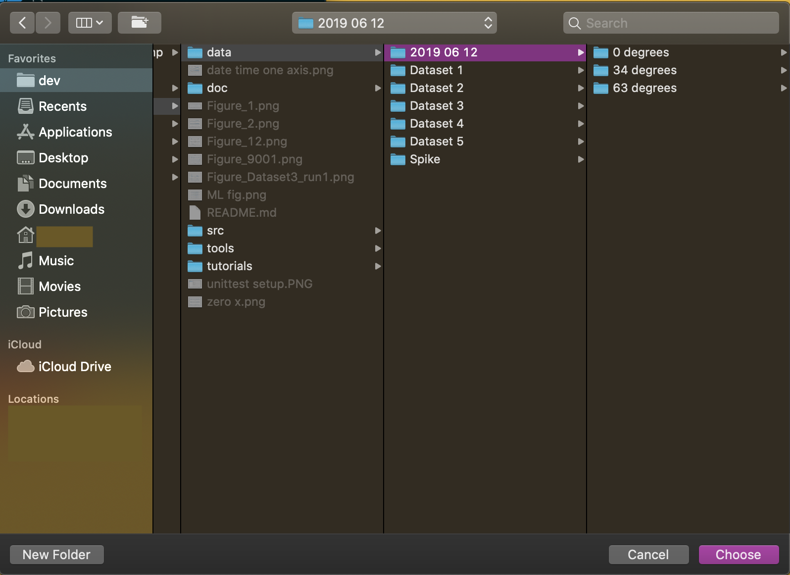
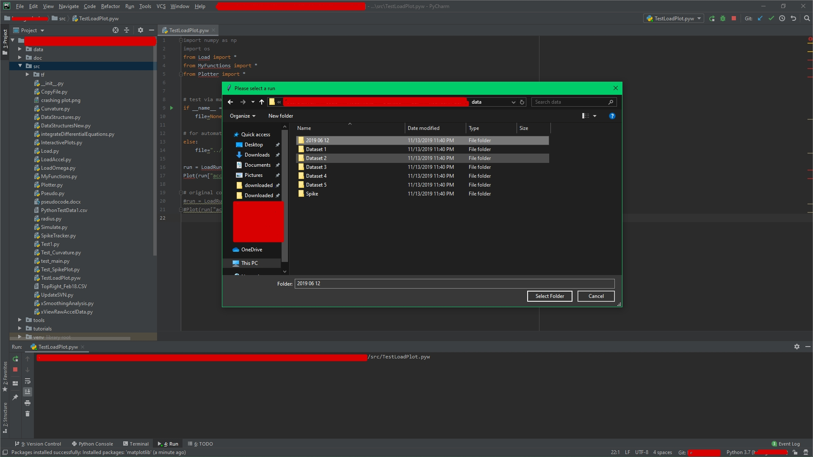
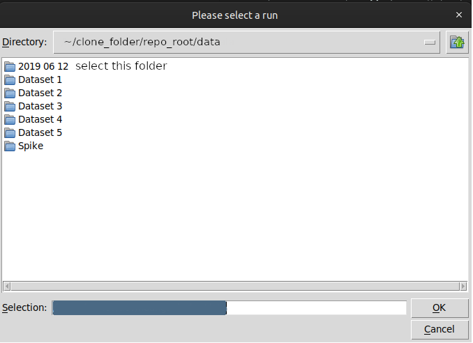

# Accelerometric Data Analysis

# About
This project seeks to understand how different accelerometers on the market collect experimental data and uses such data for real-life applications such as mapping objects in 3D space, predicting object types using a neural network, and acting as a proof of concept of how consumer wearable technologies collect and interpret user data.

# Section 1: Quickstart - root_dir: /src

### **Modules installation:**
Install numpy and matplotlib by entering the command below into your terminal.
```
$ python3 -m pip install numpy matplotlib
```
If installation yield:
```
ERROR: Could not install packages due to an EnvironmentError: [Errno 13] Permission denied: '/usr/local/bin/pip'
Consider using the `--user` option or check the permissions.
```
Elevate to root and enter root password when prompted:
```
$ sudo -H python3 -m pip install numpy matplotlib
```

### **Processing and plotting raw data:**
- New users who just forked the repo should running TestLoadPlot.pyw script to get started and get a taste of this whole project.
- Open up your favorite terminal/bash
- Change working directory to ```~/nameOfRepo/src/```
- Run the aforementioned script file
- Below are the example commands
```
$ cd nameOfRepo/src
$ { local_python_executable_PATH } TestLoadPlot.pyw
```
- A file-selecting dialog should pop up at this point.
- Go to and select ``` ~/data/2019 06 12/run1 ``` folder.
- Refer to the following illustrative screenshots:

**IF (ENV==DARWIN (i.e. Apple, macOS)):**
<<<<<<< HEAD
<<<<<<< HEAD


**IF (ENV==WIN32 (i.e. Windows distros)):**


**IF (ENV==LINUX (i.e. Ubuntu, etc.)):**


### The output should be a plot by matplotlib like this:


# Development Annotations
```
Some legends to get started:
- Annotation codes:
  - 001: convention
    - 001a: naming
    - 001b: refactoring
    - 001c: spacing
  - 002: library
    - 002a: built-in
    - 002b: user-defined
    - 002c: installed via pipelines
```

# Section 2: File Structure
```
.
..
/data
  | /2019 06 12
    | 0 degrees
    | 34 degrees
    | 63 degrees
  | Dataset 1
    | run#
      | run#.accel.accelModel.csv
      | run#.omega.instrument.csv
  | Dataset 2
  | Dataset 3
  | Dataset 4
  | Dataset 5
  | Spike
/doc
/src
/tools
/tutorials
Figure_1.png
Figure_2.png
Figure_12.png
Figure_9001.png
Figure_Dataset3_run1.png
ML fig.png --> #001c
README.md
unittest setup.png --> #001c
zero x.png --> #001c
```

## Raw Data Collection

- Raw data collected from test devices should be named ```run#.accel.modelName.csv``` and placed in ```/data/Dataset#/run#/```
- Raw data are collected in two different ways as described in the ```/tutorials/doc/AccelCamp Tutorial.docx``` file

# Section 3: Understanding modules and dependencies

Based on the ```TestLoadPlot.pyw``` file in ```src``` folder, I drew up the following mapping of dependencies and modules...

```
numpy (002c)
os (002a)
Load (002b)
  | LoadAccel (002b)
    | MyFunctions --> dialogOpenFilename
    | DataStructures --> AccelData
  | LoadOmega (002b)
  | tkinter (002a)
| MyFunctions (002b)
| Plotter (002b)
```

# Troubleshooting
Please refer to the following link to more errors [troubleshooting](doc/troubleshooting.md/).

