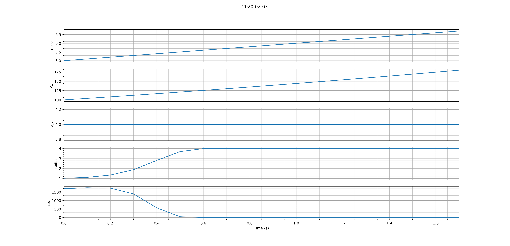
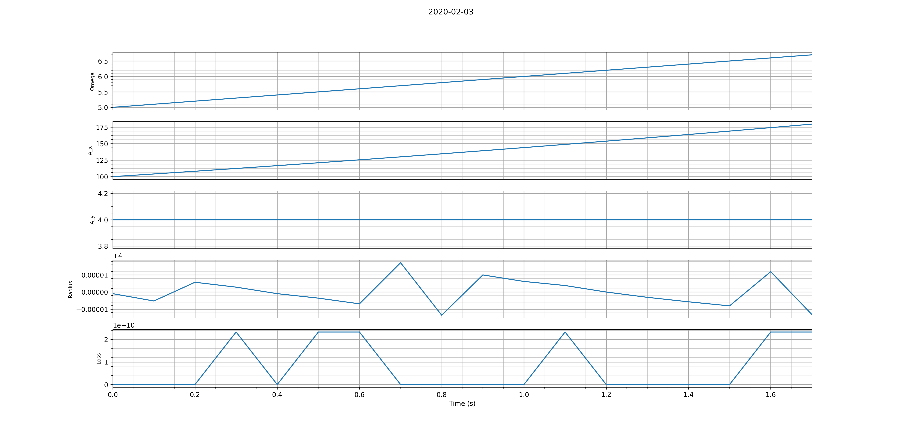
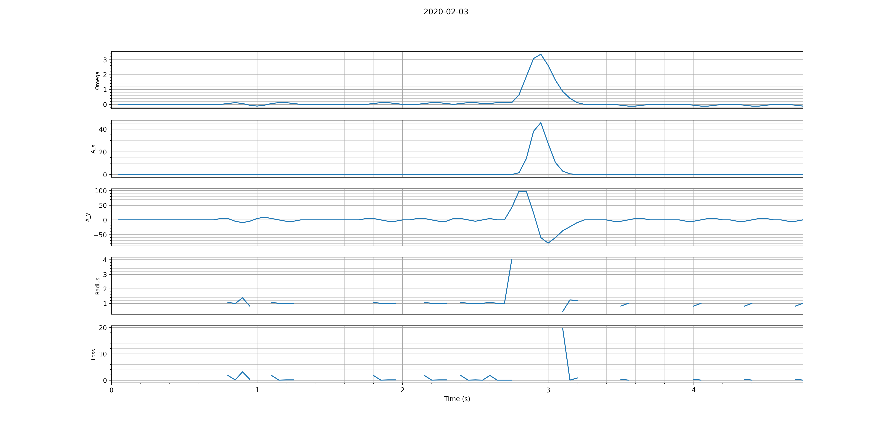

# progress report
2020 02 03

### Simulated rotary data:
- we only generate the simplest case: constant angular acceleration
motion. This yields rotary data ( angular velocity as a function of time)
### Simulated accelerometer data:
- Given omega as a function of time for a rigid body ( rotary data),
simulate radial (x) and tangential (y) accelerations for a sensor
placed at a given radial distance from the axis of rotation

### hybrid data
- load data from a PASCO rotary sensor ( angular velocity as a function of time)
- generate simulated accelerometer data

### reconstruction of rotational parameters
- recovery of the radial value associated with the simulated accelerometer data

From constant angular acceleration simulated data:

-- Plot --

### local vs global reconstruction algorithm
- Previous reconstruction uses a "global optimization" method, in which r estimate
 improves as we move through the data
- The new algorithm uses a "local optimization" method: re-initializes r at eachtime step, and iterates multiple times
on each time step: a new optimal r value for each time step.

1. From constant angular acceleration simulated data:

2. From hybrid data #1 ( ? )
--Plot--
3. From hybrid data #2 ( data/Dataset 2/ run2/xxx.pasco.csv)

### next steps
- sine wave simulated data
- smoothing data as a preprocessing step

