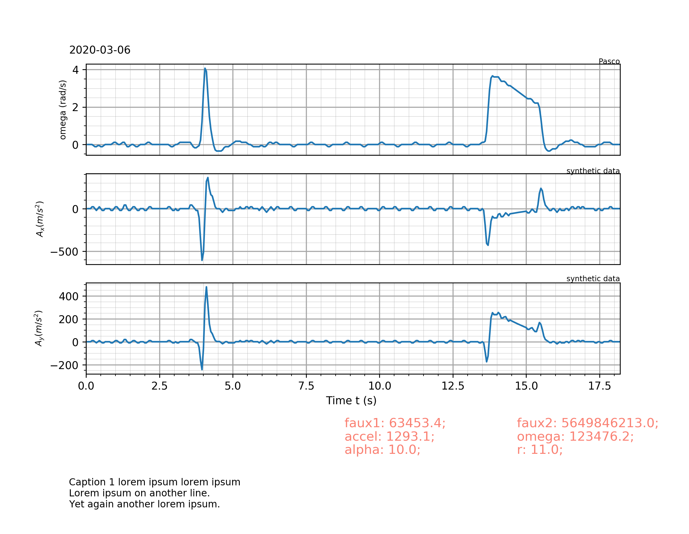
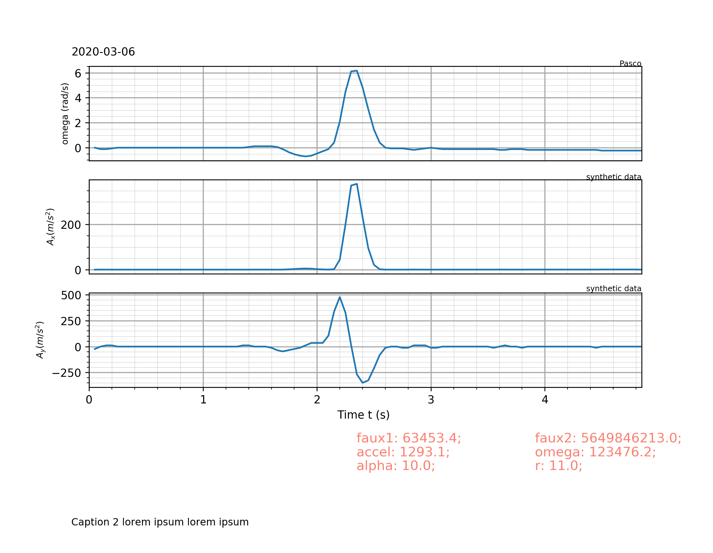

# Week 7

## Tasks:

1. `addCaption()` in `Plotter.py`
2. `appendCaptionValues()` in `Plotter.py`

## Detail:
### Adding caption
- Using `matplotlib.pyplot.figtext(x_float, y_float, str, fontsize=float32, ...)`. To be noted that x+y_float refers to positional floating not float type. A `(0, 0)` position will be bottom left corner.
- Next, need to make space for the caption by shrinking the plots. This can be easily done by injecting `bottom=float32` value into `plt.subplots_adjust` call in  `applyStyle(self)` function in `class Multiplotter`. I found `.3` to be a good enough value, but tis can be adjusted in the future.

### Appending Caption Values
- The idea is to have a dictionary of parameters extracted from executing the graphing function to be printed out for convenient experimental references.
- So far, I have figured out a way to achieve such thing with a faux dictionary to test out the method. Below is the source code with explations.
```python
...

def appendCaptionValues(self, value_dict):  # value_dict is hard-coded for the moment
    i = 0.150  # vertical spacing iterator
    k = 0.5  # horizontal spacing iterator
    for item in value_dict:
        # This figtext value-bound string print method is exactly how print in python2.7 works. Other than that, just a simple figtext() function.
        plt.figtext(k, i, item + ": " + str("%.1f" % value_dict[item]) + ";", color='salmon', fontsize="large")
        k += 0.250  # move right horizontally for next dict key
        if k >= 1:  # once right border reached
            k = 0.50  # reset horizontal to original 
            i += 0.025  # move up vertically for a new row of dict keys.
        # think of this as a typewriter... (if you're old enough or came from a country that's 5-10 years behind in modern technology).
    return

...

def Plot(AccelDatas, RotaryDatas, txt="", _dict=""):
    ...
    # this hard-coded value_dict will be replaced by value_dict = _dict once we have found out how to extract the parameter values.
    value_dict = {
        "alpha": 10,
        "r": 11,
        "accel": 1293.123,
        "omega": 123476.231,
        "faux1": 63453.36158,
        "faux2": 5649846213,
    }
    plt.addCaption(txt)
    plt.appendCaptionValues(value_dict)
    ...

```

- Use `Test_Plotter.py` in `tests/` to try it out yourself. Test_Plotter.py currently uses a default dataset to generate demonstrative plots. 

## Results
- To verify functionality. Below are the resulting plot windows.



## Todos:
- Plot data dump to csv function in Plotter.py
- Extract values for dictionary in Plotter.py