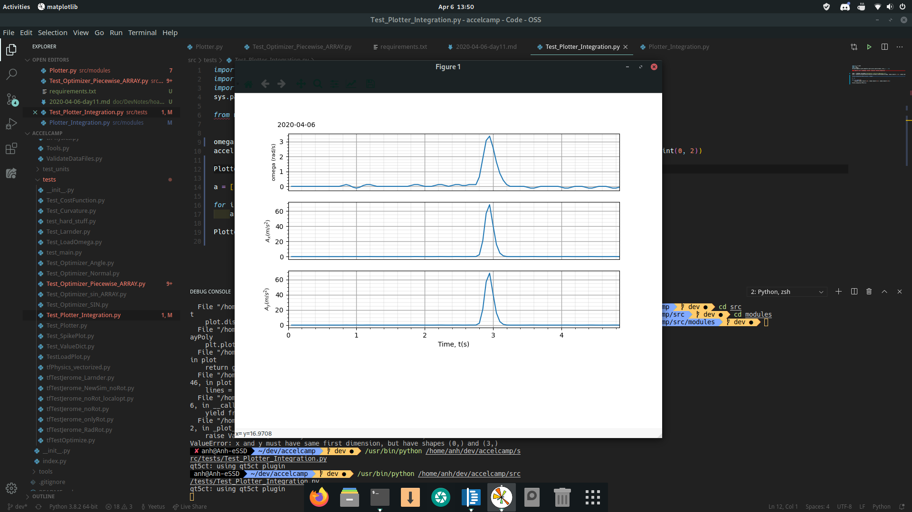
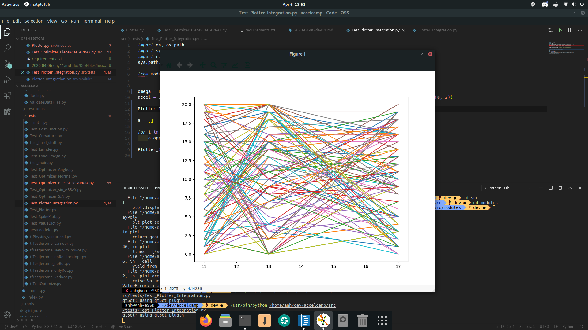

## Journal:
---------
- Integration of new Multiplotter wrapper into conslidated Multiplotter. This was done in a new `Plotter_Integration.py` file. Once everything checks out and works, the current `Plotter.py` will be deprecated and replaced.
- Integration of the Polyplotter.
- Currently, all legends and caption generators are offline for better debugging of the new Plotter. Will be reactivated.

Example of multiplotter and polyplotter in work




- Will start merge dev to master at 10PM today.

## On the topic of the project structure and using CLI to run Python scripts
----------------
The referencing issue can be eliminated by adding the following lines of code:

1. To be run in the shell:

```bash
$ export PYTHONPATH=/path/to/repo/src
```

2. To be added in the python script itself

```python
import os, os.path
import sys

sys.path.append(os.path.abspath(os.path.join(os.path.dirname(__file__), '..')))

from modules import Plotter_Integration
# must explicitly import the modules you want to use, for this example Plotter_Integration.py

# Referencing the module example:
Plotter_Integration.MPPlot(*args)
...
```

## Some archaic tkinter issues:
- On Linux (ArchLinux to be more specific), can be fixed by installing `tk` via `pacman`
```shell
# pacman -S tk
```
- Other OSes are referenced in `troubleshooting.md`