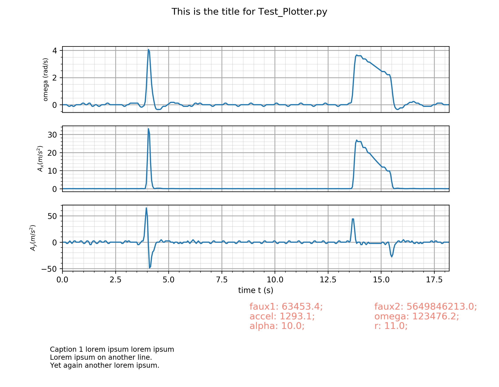

# Debugging and fixing modules according to last received e-mail update from Chris:

A comprehensive progress table

| No. | Problem | Status | Note |
|-----|---------|:--------:|------| 
| 1 | `setTitle()` not implemented | Solved | adding `plt.suptitle(string)` line under `setTitle()` function. |
| 2 | Things not working when using `DisplayPoly()` | Investigating | |
| 2.1 | `setCaptionText()` non-functioning | Pending review | |
| 2.2 | `xAxisLabel` not displaying | Pending review | |
| 2.3 | `yAxisLabel` not displaying | Pending review | |

## Results:

## #1

