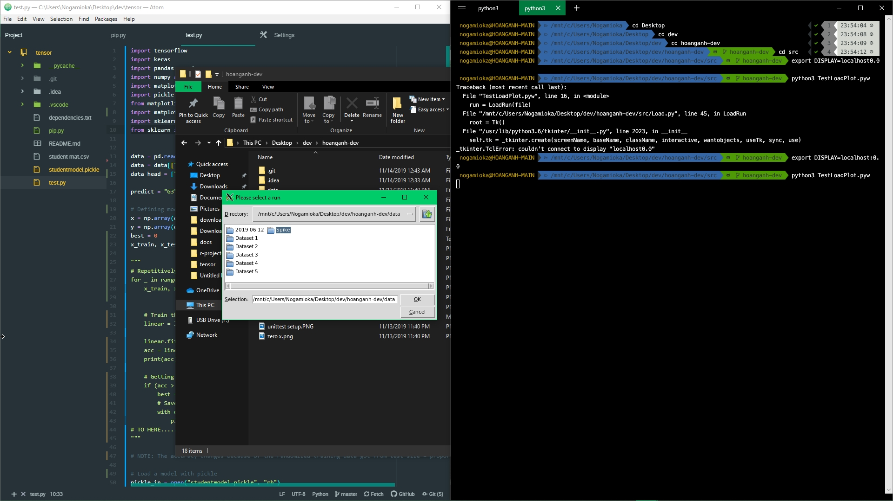

# Project debug log
**Date:** Thursday, November 21, 2019
**Tester:** Hoang Anh

## This is the solution for Windows problem with tkinter
**Description:**
- Python needs to have a target screen/display in order to use GUI backends such as matplotlib or running .pyw scripts using _tkinter. 
- With the following dependencies have already been installed (may or may not be relevant to the error):
    - numpy
    - matplotlib
    - sklearn
    - scipy
    - pandas
    - keras
    - python3.6-tk (or any python*.*-tk)
    - tkinter

**Solutions:** This applies for matplotlib and .pyw dialogs using tkinter
1. Install Xming X Server for Windows
https://sourceforge.com/projects/xming/

2. Install VcXsrv Windows X Server
https://sourceforge.com/projects/vcxsrv

3. Click Windows button to bring up the Windows Start Menu

4. Search for xlaunch.exe and Run it.

5. On the dialog window, choose multiple windows. Click Next until finish.

6. Using Windows Subsystem for Linux terminal, type in:
```
export DISPLAY=localhost:0.0
```
and hit Enter

7. Now the backends can be run without GUI errors.

**Context of Solution:**
[REDACTED]
## Proof:
