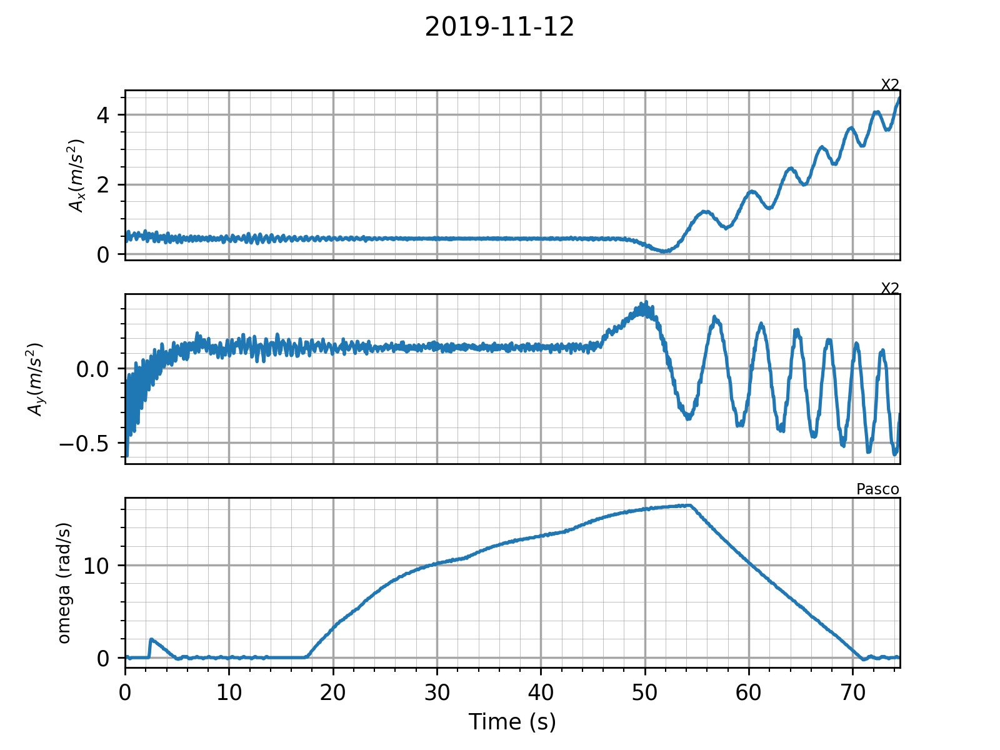

# Project Test log
<<<<<<< HEAD
<<<<<<< HEAD
**Date:** Friday, November 8, 2019
**Tester:** Hoang Anh
=======
>>>>>>> added new test note on commit date
=======
**Date:** Friday, Novemeber 8, 2019
**Tester:** Hoang Anh
>>>>>>> update previous dev note

### Run environment:
- Run successful with Python version 3.7.3
- Anaconda: NO
- All dependencies required in my README.md are satisfied, installed and updated to latest version
```
System Software Overview:
      System Version: macOS 10.15 (19A603)
      Kernel Version: Darwin 19.0.0
      Boot Volume: macOS
      Boot Mode: Normal
      Computer Name: [REDACTED]
      User Name: [REDACTED]
      Secure Virtual Memory: Enabled
      System Integrity Protection: Enabled
      Time since boot: 15 days 3:25
```
<<<<<<< HEAD
Note: To display your own system information, please refer to the instructions below.

- For Ubuntu/Linux:
```
$ hostnamectl
```

- For Apple &copy; macOS &trade; :
```
$ SPSoftwareDataType
```

- For Windows:
```
1. Windows Key + R
2. Type "dxdiag" into dialog box
3. Press Enter  
```
=======
>>>>>>> added new test note on commit date

### DataStructuresNew.py (ON BRANCH master)
- Run output:
```
x values  [1. 4. 7.]
z values  [3. 6. 9.]
```
### Plotter.py (ON BRANCH dev1)
- Run successful
- Run output: n/A

### LoadAccel.py (ON BRANCH dev1)
- Run unsuccessful
- Run diagnostics: break at "_tkinter" - no module found
- Run troubleshooting: macOS Python 3.7.3 distribution is extremely buggy (according to Python documentation website). This could be solved by using brew and install the latest version of Python 3.7.5, effectively replacing the default Python that comes with macOS.
**Solution steps:**
- Step 0: Open terminal
- Step 1: Install brew package manager if not already.
```
$ /usr/bin/ruby -e "$(curl -fsSL https://raw.githubusercontent.com/Homebrew/install/master/install)"
```
- Step 2: Change current user permission for Python folders on your macOS environment. Input your sudo password when prompted.
```
$ sudo chown -R $(whoami) /usr/local/lib/pkgconfig /usr/local/share/info /usr/local/share/man/man3 /usr/local/share/man/man5
```
```
$ chmod u+w /usr/local/lib/pkgconfig /usr/local/share/info /usr/local/share/man/man3 /usr/local/share/man/man5
```
- Step 3: Install the latest Python distribution (3.7.5)
```
$ brew install python3
```
- Step 4 (optional): Re-install dependencies when prompted with 
```
... no module <module name>
```
by running the script below
```
$ python3 -m pip install <module name 1> <module name 2> ...
```
<<<<<<< HEAD
- After the fix, LoadAccel.py runs successful, no error output yielded.
## TestLoadPlot.pyw - Successful run on DARWIN platform
Run output:


# --- End of Testing Log --- 
=======
>>>>>>> added new test note on commit date
